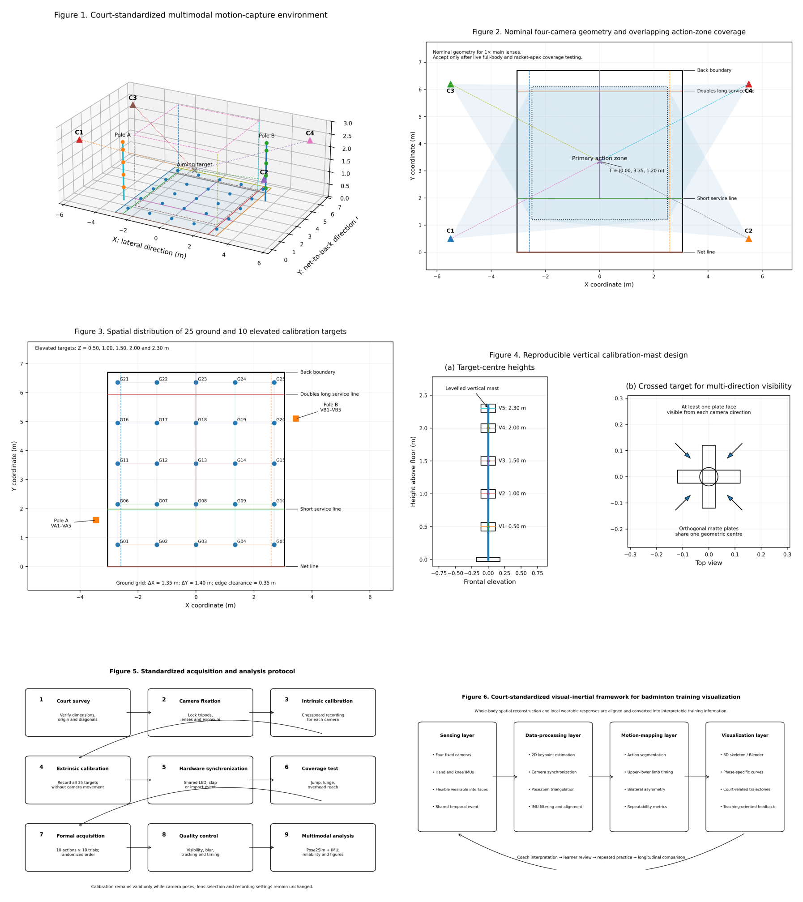

# BadmintonFusion35

### A Four-Camera Visual–IMU Dataset for Badminton Motion Analysis


BadmintonCourt35 is a reproducibility package for a court-standardized badminton
training study using four fixed cameras, 35 non-coplanar scene control points and four
limb-mounted IMUs. It converts the original participant-specific scripts into explicit,
testable functions and a single command-line interface.

This is a **public research-code release**. Version 0.2.0 includes a limited four-view
demonstration and a compact end-to-end `A10-R10` evidence package from one consenting
author-participant. It does not claim that the full
multi-participant paper dataset or every paper result is publicly reproducible.

## What is already implemented

- locked P01-P35 control-point generation and validation;
- TRC reading and motion-energy construction;
- reconstruction of batched or repeated IMU host timestamps;
- 50 Hz, fourth-order, 10 Hz zero-phase Butterworth filtering without bridging gaps;
- nearest-sample mapping from 60 Hz visual data to 50 Hz IMU data with timing audit;
- variable-specific optical/IMU inclusion gates;
- camera residual audit that keeps pixel error separate from spatial accuracy;
- Benjamini-Hochberg FDR correction and standardized PCA;
- paper-workbook audit for PCA, FDR sensitivity, out-of-fold ROC and clustered bootstrap CIs;
- a safe Pose2Sim stage adapter that defaults to a dry run;
- an anonymous synthetic end-to-end example;
- a de-identified real-trial chain linking synchronized four-camera 2D keypoints,
  35-point calibration, filtered 3D coordinates, IMU alignment and trial metrics.

## Installation

Use the existing Pose2Sim Python environment:

```powershell
$Python = "$env:USERPROFILE\.venv\pose2sim\Scripts\python.exe"
Set-Location "<path-to-BadmintonCourt35>"
& $Python -m pip install -e .
```

The core package requires NumPy, pandas and SciPy. Pose2Sim is imported only when a
real Pose2Sim stage is explicitly executed.

## First verification

```powershell
court35 validate-control-points `
  --csv "<FORMAL_PROJECT>\calibration\scene_points_click_order.csv" `
  --trc "<FORMAL_PROJECT>\calibration\Object_points.trc"
```

Audit the retained calibration residual evidence:

```powershell
court35 audit-calibration `
  --residuals "<ANALYSIS_READY>\P01\01_Protocol_Config\calibration\extrinsics_point_residuals.csv" `
  --summary "reports\P01_calibration_residual_summary.csv" `
  --report "reports\P01_calibration_residual_audit.json"
```

Generate the non-identifiable demonstration:

```powershell
court35 demo --output-dir "examples\demo\generated"
```

Regenerate the compact real-trial evidence package from the private formal project:

```powershell
court35 export-a10-r10 `
  --project-root "<FORMAL_POSE2SIM_PROJECT>" `
  --output-dir "examples\a10_r10"
```

Audit the formal paper statistics (requires `pip install -e ".[paper]"`):

```powershell
court35 audit-paper-workbook `
  --workbook "<PAPER_AUDIT_WORKBOOK.xlsx>" `
  --report "reports\paper_workbook_audit.json"
```

Run all standard-library tests:

```powershell
$env:PYTHONPATH = "$PWD\src"
python -m unittest discover -s tests -v
```

## Pose2Sim safety boundary

The adapter is a dry run unless `--execute` is provided:

```powershell
court35 pose2sim `
  --config "<FORMAL_PROJECT>\Config.toml" `
  --stages calibration poseEstimation synchronization triangulation filtering
```

Only after reviewing the printed plan should a real run use `--execute`. The code never
deletes the original participant directory.

## Data policy

Do not commit additional participant videos, raw IMU dumps, C3D files, archives or identifiable
renderings to Git history. Git contains only code, configuration, small de-identified
tables, a limited derived real-trial package and synthetic examples. A deliberately limited author-participant demonstration
is distributed separately as versioned GitHub Release assets. The MIT License applies to
software and documentation only; see `MEDIA_NOTICE.md` and `DATA_NOTICE.md`.

## Four-camera demonstration

Version 0.1.1 provides four processed views of A10 repeat 10 (`A10-R10`) performed by a
consenting author-participant. The study owner confirmed permission to display both the
participant and the venue. Audio streams and source creation-time metadata were removed
without re-encoding the H.264 video.

The clips were independently trimmed and have unequal frame counts. They demonstrate
multi-view coverage and pose-overlay output, but they are **not** a frame-level
synchronization-accuracy benchmark. See
[`examples/four_camera_demo`](examples/four_camera_demo/README.md) for technical metadata,
checksums and the fixed release links.

The repository also contains the small
[`A10-R10 reproducibility package`](examples/a10_r10/README.md): 203 synchronized
visual frames from all four cameras, their 2D keypoints, filtered 3D coordinates,
the associated 35-point calibration evidence, 169 aligned samples from each of four
IMUs, trial metrics, provenance hashes and machine-readable audit results.

## Citation and availability

The source code, calibration workflow, quality-auditing utilities and reproducible
analysis pipeline are publicly available at
<https://github.com/mgck2nzwry-oss/Court35>. Cite the software using the
repository's `CITATION.cff`. When the associated article is published, cite both the
article and the archived software release.

Suggested manuscript statement:

> The source code, calibration workflow, data-quality auditing utilities, and
> reproducible analysis pipeline are publicly available on GitHub at
> https://github.com/mgck2nzwry-oss/Court35 (version 0.2.0). A limited
> four-camera demonstration and a compact, de-identified A10-R10 evidence chain from one
> consenting author-participant are provided; the complete multi-participant dataset is
> not publicly distributed.

## Reproducibility status

| Component | v0.2 status |
|---|---|
| Formal 35-point geometry | Implemented and checked against P01 formal files |
| Pose2Sim orchestration | Implemented; real execution requires explicit opt-in |
| IMU time reconstruction/filtering | Implemented and checked against formal local files |
| 60-to-50 Hz nearest mapping | Implemented and timing-audited |
| Variable-specific QC | Implemented |
| PCA and FDR | Implemented |
| LOPO outputs | All OOF probabilities, ROC curves and clustered-bootstrap CIs are auditable |
| Exact LOPO model training | Blocked until the authoritative classifier specification is identified |
| Real end-to-end example | A10-R10: 4-view 2D, 35-point calibration, 3D, aligned 4-IMU data and audits |
| Human-participant media | Limited author-participant four-view demonstration; full dataset not public |
| Public software license/citation | MIT; software citation metadata included |

See [method provenance](docs/METHOD_PROVENANCE.md) and the
[paper reproducibility boundary](docs/PAPER_REPRODUCIBILITY.md), the
[relationship to existing projects](docs/RELATED_WORK.md), then the
[validation environment](docs/VALIDATION_ENVIRONMENT.md) and
[release checklist](docs/RELEASE_CHECKLIST.md), before any public push.
