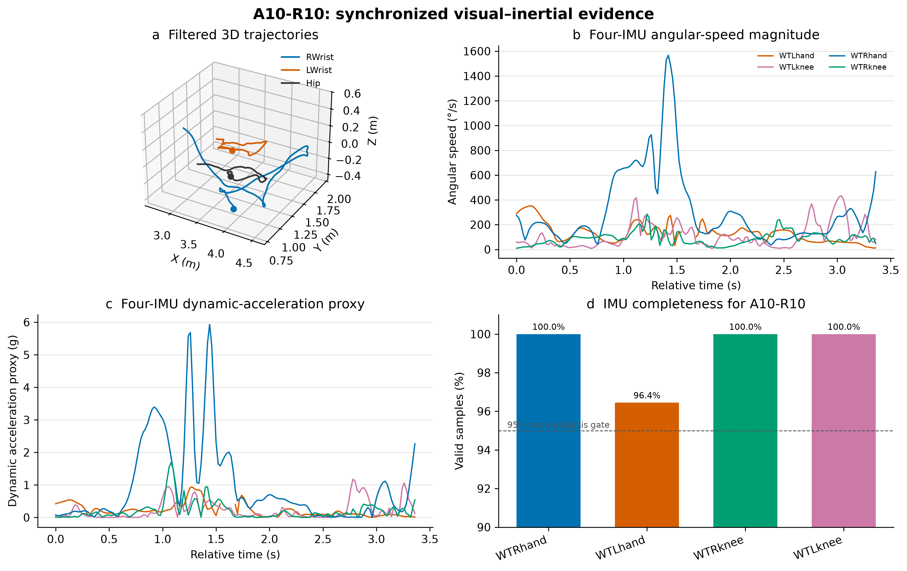

# A10-R10 reproducibility evidence

This directory is the compact, de-identified evidence chain for action A10, repetition
10, from one consenting author-participant:

```text
four cameras -> synchronized 2D keypoints -> 35-point calibration -> filtered 3D
             -> affine visual/IMU clock alignment -> 50 Hz IMU and trial metrics
```

The package contains 203 synchronized visual frames (3.367 s at 60 Hz), 26 2D
keypoints from each of four cameras, 22 filtered 3D markers, and 169 samples from each
of four IMUs at 50 Hz. `metadata.json` records the selected interval, camera frame
offsets, source-content hashes, clock model, audit results and scientific limitations.
`checksums.sha256` verifies every published file.



Regenerate the overview with `python scripts/plot_a10_r10.py`. The plotted dynamic
acceleration is the orientation-invariant proxy `|‖a‖ - 1 g|`; it is not asserted to
be world-coordinate linear acceleration.

Regenerate it from the private formal project without modifying source data:

```powershell
court35 export-a10-r10 `
  --project-root "<FORMAL_POSE2SIM_PROJECT>" `
  --output-dir "examples\a10_r10"
```

The calibration residual report is expressed in pixels. It is evidence of image-space
fit, not an independent centimetre-level 3D accuracy validation. The latter remains a
stated limitation until held-out known-distance or dynamic reference measurements are
available.

The MIT License applies to the exporter code, not automatically to these derived
research data. The data are published for scholarly inspection and citation; see
`DATA_NOTICE.md` at the repository root.
